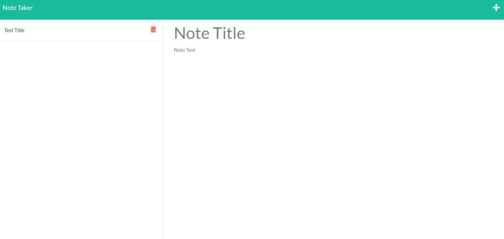
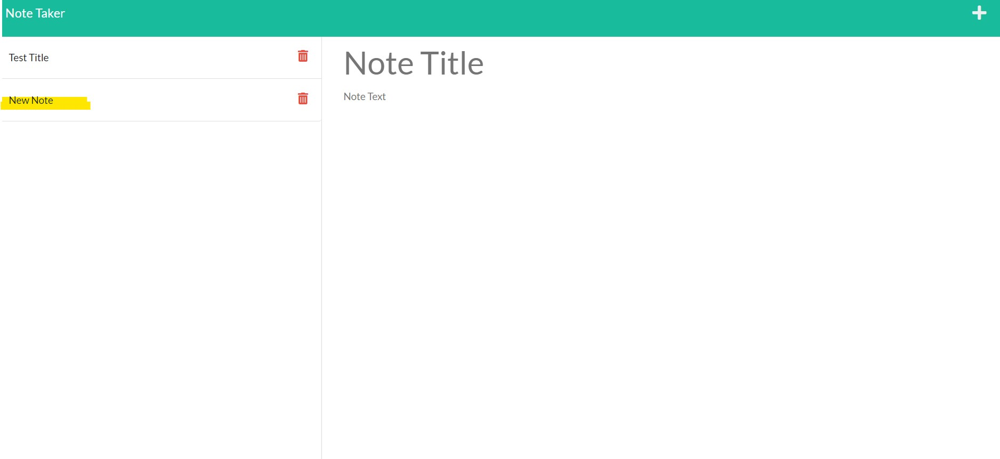

## Note Taker

[]

## Description

This simple app provides users with a place to add, store, and delete notes throughout their day.

## Table of Contents

- [Installation](#installation)
- [Usage](#usage)
- [License](#license)
- [Credits](#credits)
- [Contributing](#contributing)
- [Questions](#questions)

## Installation

Make sure you have node installed in your parent folder to run this app locally.

## Usage

![Link to deployed app.] (https://note-taker-app15.herokuapp.com/)

![Link to github repository.] (https://github.com/bnicp/hw11-note-taker)

## License

MIT: https://opensource.org/licenses/MIT

## Contributing

Clone this code into a new branch and contant me with anything you'd like to commit to main.

## Questions

Email: bnp415@gmail.com
Github: https://github.com/bnicp
